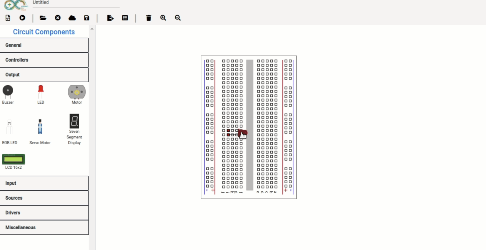

## Summary: Solving LED Connection Issue on Rotated Components

### Problem Statement
The LED component was not connecting to the intended points on the breadboard after being rotated. This issue arose because the connection logic did not account for the new positions of the nodes after the component was rotated.

### Approach and Solution

1. **Identify the Root Cause**:
   - The root cause was that the node positions were not being updated correctly after rotating the component. This resulted in the connection logic still using the original positions of the nodes.

2. **Adding a Property**:
   - Introduced a new property `pointHalf` to the `CircuitElement` class to store half the size of the circuit node.
   ```typescript
   public pointHalf: number;
3. **Modifying the Constructor**:
   - Updated the constructor to initialize the pointHalf property using data from a JSON file.
    ```typescript
    this.pointHalf = obj.pointHalf;
    this.DrawNodes(canvas, obj.pins, obj.pointHalf);

4. **Implementing Rotation Logic**:
   - Added a rotate method to handle the rotation of the component and update the positions of its nodes.
   ```typescript
    rotate(degrees: number): void {
    const rad = degrees * (Math.PI / 180);
    const centerX = this.x + this.tx;
    const centerY = this.y + this.ty;

    this.elements.transform(`r${degrees},${centerX},${centerY}`);
    this.updateNodePositions(rad, centerX, centerY);
    }

5. **Updating Node Positions** :
   - Added an updateNodePositions method to recalculate the node positions based on the rotation angle and center of the component.
     ```typescript
     updateNodePositions(rad: number, centerX: number, centerY: number): void {
     for (const node of this.nodes) {
     const offsetX = node.x - centerX;
     const offsetY = node.y - centerY;
     const rotatedX = centerX + (offsetX * Math.cos(rad) - offsetY * Math.sin(rad));
     const rotatedY = centerY + (offsetX * Math.sin(rad) + offsetY * Math.cos(rad));
     node.move(rotatedX, rotatedY);
     }
     }

 **Outcome**
By implementing the above changes, the LED component can now correctly connect to the intended points on the breadboard even after being rotated. The solution ensures that both the visual representation and logical connection points of the component are updated appropriately.


**Commit Message**
feat: Add rotation functionality to CircuitElement
- Added `pointHalf` property to store half the size of the circuit node.
- Modified constructor to initialize `pointHalf` property.
- Added `rotate` method to rotate the circuit element by a specified degree.
- Added `updateNodePositions` method to update node positions after rotation.


 LED Component Connected Correctly After Rotation" clearly states what the screenshot demonstrates, which is the successful connection of the LED component after implementing the rotation logic.


